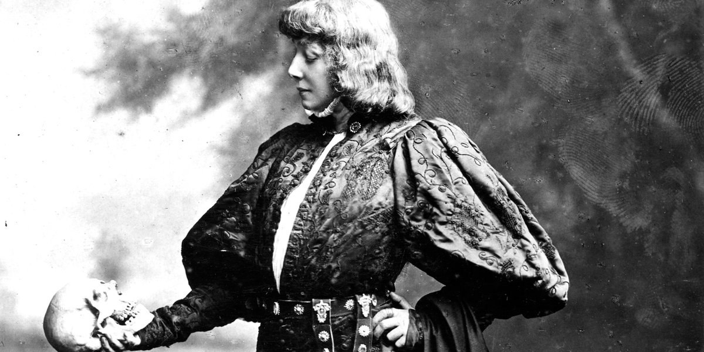

- Look at the way the older generation behave
   in Act 2, all employing spies to investigate their children’s 
  behaviour. What does this tell us about the relationships between the 
  generations? What kind of relationship does Polonius have with Claudius 
  and Gertrude? What do you think his position is within the castle and 
  how might this affect the way Polonius feels about a potential 
  relationship between his daughter Ophelia and Hamlet?

- Take note of Hamlet’s letter to Ophelia and
   his conversation with Polonius. What do the letter and the conversation
   show you about Hamlet? He later suggests to Rosencrantz and 
  Guildenstern that he might not be mad and that he’s been putting on an 
  act like one of the travelling players might - do you believe him? Is 
  his conversation with Polonius a performance? Do you think he knows he 
  is being watched?

- In Act 2 we see Hamlet’s actions change and
   the people around him start to observe different behaviour. How many 
  examples of Hamlet’s changing behaviour can you find in these two 
  scenes? Do you think that these changes are part of Hamlet’s plan or has
   he really changed?
